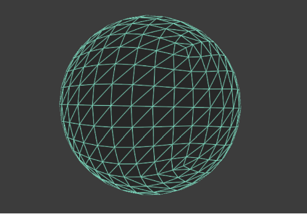
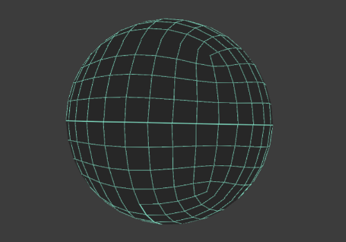

# Selective Edge Wireframe Shader
==================================

A wireframe shader based off of [this Nvidia white paper](http://developer.download.nvidia.com/SDK/10/direct3d/Source/SolidWireframe/Doc/SolidWireframe.pdf) that allows you to select which edges of the triangle to shade.

## All Edges Shaded

## Only 3rd Triangle Edge

Problems: edges on most triangles are drawn from edge outward, so sometimes edges between triangles will not align for triangles of different orientations.